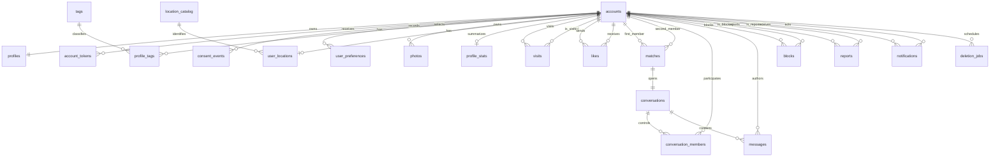

# Matcha — modèle des données persistées

Ce document décrit les données nécessaires à la partie obligatoire, leur emplacement et
leurs relations. Il est compatible avec `TASKS.md`, `API_AND_QUERIES.md` et les règles de
code. Il servira de référence pour écrire les migrations SQL manuelles PostgreSQL.

## 1. Principes du modèle

- PostgreSQL contient uniquement les données métier durables.
- Valkey contient les données temporaires : sessions, présence, limites de débit,
  idempotence courte et bus Socket.IO.
- MinIO contient les fichiers image privés ; PostgreSQL conserve leurs métadonnées et clés.
- Les identifiants métier exposés sont des UUID générés côté serveur.
- Les timestamps sont des `timestamptz` enregistrés en UTC.
- Les noms de tables et colonnes sont en anglais, en `snake_case`.
- Les préférences et le GPS sont sensibles ; leur accès doit rester limité aux requêtes qui
  en ont réellement besoin.
- L'e-mail, la date de naissance et les coordonnées réduites ne sont jamais sélectionnés
  dans une réponse de profil public.
- Les scores, âges et états dérivables ne viennent jamais du frontend.
- Aucun ORM : migrations et accès avec SQL paramétré via psycopg 3.

## 2. Vue d'ensemble relationnelle



Les deux relations vers une même table représentent des rôles différents. Par exemple,
`likes.source_user_id` est l'auteur et `likes.target_user_id` est le destinataire.

## 3. Types contrôlés

Préférer des colonnes `text` avec contraintes `CHECK` explicites plutôt que des types ENUM
PostgreSQL difficiles à faire évoluer.

| Domaine | Valeurs obligatoires |
| --- | --- |
| `gender` | `man`, `woman`, `non_binary` |
| `account_status` | `pending_verification`, `active`, `deletion_pending` |
| `token_type` | `verify_email`, `reset_password`, `confirm_email` |
| `consent_purpose` | `matching_preferences`, `gps_location` |
| `location_source` | `manual`, `gps_reduced` |
| `match_status` | `active`, `ended_unlike`, `ended_block` |
| `notification_type` | `like_received`, `profile_visited`, `match_created`, `message_received`, `match_ended` |
| `report_reason` | liste contrôlée définie par la modération |

Toute nouvelle valeur nécessite une migration, un test et une mise à jour de la documentation.

## 4. Identité et authentification

### `accounts`

Contient les informations de connexion et le cycle de vie du compte.

| Colonne | Type | Contraintes et rôle |
| --- | --- | --- |
| `id` | `uuid` | PK |
| `email` | `text` | obligatoire, forme normalisée, unique insensible à la casse |
| `pending_email` | `text` | nullable, jamais actif avant confirmation |
| `username` | `text` | obligatoire, normalisé, unique insensible à la casse |
| `password_hash` | `text` | hash Argon2id, jamais exposé |
| `status` | `text` | valeur contrôlée |
| `email_verified_at` | `timestamptz` | nullable avant vérification |
| `last_login_at` | `timestamptz` | gestion de l'inactivité |
| `inactivity_warning_sent_at` | `timestamptz` | nullable |
| `created_at` | `timestamptz` | obligatoire |
| `updated_at` | `timestamptz` | obligatoire |

Utiliser des index uniques sur `lower(email)` et `lower(username)`. La suppression du compte
supprime la ligne : aucun soft delete permanent ne doit permettre de reconstruire le profil.

### `account_tokens`

Jetons à usage unique pour vérification, réinitialisation et nouvel e-mail.

| Colonne | Type | Contraintes et rôle |
| --- | --- | --- |
| `id` | `uuid` | PK |
| `account_id` | `uuid` | FK `accounts`, cascade |
| `type` | `text` | valeur contrôlée |
| `token_hash` | `bytea` | unique ; le token brut n'est jamais stocké |
| `payload` | `jsonb` | données minimales, par exemple nouvel e-mail normalisé |
| `expires_at` | `timestamptz` | expiration serveur |
| `consumed_at` | `timestamptz` | nullable, empêche la réutilisation |
| `created_at` | `timestamptz` | obligatoire |

Le `payload` est validé par type et ne devient pas un stockage JSON générique.

## 5. Profil, préférences et consentements

### `profiles`

Une ligne exactement par compte.

| Colonne | Type | Contraintes et rôle |
| --- | --- | --- |
| `user_id` | `uuid` | PK et FK `accounts`, cascade |
| `first_name` | `text` | obligatoire |
| `last_name` | `text` | obligatoire |
| `birth_date` | `date` | obligatoire, contrôle 18+ côté serveur |
| `gender` | `text` | nullable pendant onboarding, puis valeur contrôlée |
| `bio` | `text` | nullable pendant onboarding, longueur bornée |
| `created_at` | `timestamptz` | obligatoire |
| `updated_at` | `timestamptz` | obligatoire |

L'âge et la complétude sont calculés dans les requêtes/services. Ne pas stocker `age` ni
accepter un booléen `is_complete` envoyé par le client.

### `user_preferences`

Ensemble des genres recherchés. Zéro ligne signifie « tous les genres » uniquement lorsque
le consentement sensible courant est actif.

| Colonne | Type | Contraintes et rôle |
| --- | --- | --- |
| `user_id` | `uuid` | FK `accounts`, cascade |
| `desired_gender` | `text` | valeur `gender` contrôlée |
| `created_at` | `timestamptz` | obligatoire |

PK composite : `(user_id, desired_gender)`. Le retrait du consentement supprime toutes les
lignes correspondantes dans la même transaction.

### `consent_events`

Journal immuable de preuve et de retrait. L'état courant est le dernier événement d'une
finalité ; une vue SQL peut exposer ce résultat.

| Colonne | Type | Contraintes et rôle |
| --- | --- | --- |
| `id` | `uuid` | PK |
| `user_id` | `uuid` | FK `accounts`, cascade |
| `purpose` | `text` | finalité contrôlée |
| `policy_version` | `text` | version exacte du texte présenté |
| `granted` | `boolean` | `true` pour accord, `false` pour retrait |
| `occurred_at` | `timestamptz` | horodatage serveur |

Ne pas enregistrer adresse IP ou user-agent comme preuve par défaut : ils ne sont pas
nécessaires au sujet et augmenteraient les données personnelles collectées.

### `tags`

| Colonne | Type | Contraintes et rôle |
| --- | --- | --- |
| `id` | `uuid` | PK |
| `name` | `text` | libellé affiché |
| `normalized_name` | `text` | unique |
| `created_by_user_id` | `uuid` | FK nullable ; passe à `NULL` si le créateur est supprimé |
| `created_at` | `timestamptz` | obligatoire |

### `profile_tags`

Table de liaison avec PK `(user_id, tag_id)`. Les FK vers `accounts` et `tags` utilisent la
cascade. Un profil complet exige au moins une liaison, vérifiée par le service.

## 6. Photos et localisation

### `photos`

PostgreSQL ne stocke pas les octets de l'image.

| Colonne | Type | Contraintes et rôle |
| --- | --- | --- |
| `id` | `uuid` | PK |
| `user_id` | `uuid` | FK `accounts`, cascade |
| `object_key` | `text` | clé MinIO privée, unique |
| `mime_type` | `text` | JPEG, PNG ou WebP après réencodage |
| `byte_size` | `integer` | positif et ≤ 5 Mio |
| `width` / `height` | `integer` | positifs et ≤ 4096 |
| `position` | `smallint` | de 1 à 5, unique par utilisateur |
| `is_main` | `boolean` | false par défaut |
| `created_at` | `timestamptz` | obligatoire |

Un index unique partiel `(user_id) WHERE is_main` garantit au plus une principale. Le service
et un trigger de contrainte différé garantissent : zéro photo autorisée ; dès qu'une photo
existe, exactement une principale ; jamais plus de cinq.

### `location_catalog`

Catalogue local de villes/quartiers utilisé hors ligne.

| Colonne | Type | Contraintes et rôle |
| --- | --- | --- |
| `id` | `uuid` | PK |
| `country_code` | `char(2)` | obligatoire |
| `city_name` | `text` | obligatoire |
| `district_name` | `text` | nullable |
| `normalized_label` | `text` | indexé pour l'autocomplétion |
| `centroid_latitude` / `centroid_longitude` | `double precision` | centroïde approximatif |

### `user_locations`

Une localisation active maximum par utilisateur.

| Colonne | Type | Contraintes et rôle |
| --- | --- | --- |
| `user_id` | `uuid` | PK et FK `accounts`, cascade |
| `catalog_location_id` | `uuid` | FK `location_catalog`, restrict |
| `source` | `text` | `manual` ou `gps_reduced` |
| `reduced_latitude` / `reduced_longitude` | `double precision` | coordonnées réduites, jamais publiques |
| `updated_at` | `timestamptz` | obligatoire |

Pour une saisie manuelle, les coordonnées correspondent au centroïde du catalogue. Pour le
GPS, elles sont réduites à la précision quartier avant insertion. PostgreSQL calcule la
distance avec une formule SQL documentée, sans imposer PostGIS.

## 7. Popularité et activité

### `profile_stats`

Cache serveur pour trier rapidement ; les tables métier restent la source de vérité.

| Colonne | Type | Contraintes et rôle |
| --- | --- | --- |
| `user_id` | `uuid` | PK et FK `accounts`, cascade |
| `active_likes_count` | `integer` | ≥ 0 |
| `active_matches_count` | `integer` | ≥ 0 |
| `unique_visitors_30d_count` | `integer` | ≥ 0 |
| `popularity_score` | `smallint` | entre 0 et 100 |
| `last_seen_at` | `timestamptz` | dernière activité persistée, nullable avant première session |
| `computed_at` | `timestamptz` | fraîcheur du calcul |

Le score suit exactement la formule de `TASKS.md`. Il est recalculé depuis `likes`, `matches`
et `visits`, jamais accepté depuis React.

La présence courante vit dans Valkey. Lors d'une expiration ou déconnexion, le service met à
jour `profile_stats.last_seen_at` afin d'afficher la dernière connexion sans enregistrer
chaque heartbeat.

## 8. Visites, likes et matchs

### `visits`

Chaque consultation humaine autorisée crée un événement.

| Colonne | Type | Contraintes et rôle |
| --- | --- | --- |
| `id` | `uuid` | PK |
| `visitor_user_id` | `uuid` | FK `accounts`, cascade |
| `visited_user_id` | `uuid` | FK `accounts`, cascade |
| `visited_at` | `timestamptz` | obligatoire |
| `notification_sent` | `boolean` | false par défaut |

Contrainte : visiteur différent du profil visité. Les lignes détaillées sont supprimées après
90 jours. La fenêtre de notification de 24 h se vérifie par paire et date.

### `likes`

Une ligne durable par relation directionnelle ; elle peut être réactivée après unlike.

| Colonne | Type | Contraintes et rôle |
| --- | --- | --- |
| `id` | `uuid` | PK |
| `source_user_id` | `uuid` | FK `accounts`, cascade |
| `target_user_id` | `uuid` | FK `accounts`, cascade |
| `is_active` | `boolean` | état actuel |
| `activated_at` | `timestamptz` | dernière activation |
| `deactivated_at` | `timestamptz` | nullable |
| `created_at` | `timestamptz` | première création |

Contrainte unique `(source_user_id, target_user_id)` et utilisateurs différents. Après un
unlike, un futur match exige que les deux lignes soient activées à nouveau.

### `matches`

Une paire peut avoir plusieurs matchs historiques, mais un seul actif.

| Colonne | Type | Contraintes et rôle |
| --- | --- | --- |
| `id` | `uuid` | PK |
| `user_low_id` / `user_high_id` | `uuid` | paire canonique, FK `accounts`, cascade |
| `status` | `text` | valeur contrôlée |
| `created_at` | `timestamptz` | obligatoire |
| `ended_at` | `timestamptz` | nullable si actif |
| `ended_by_user_id` | `uuid` | FK nullable, cascade avec le compte |

Contraintes : `user_low_id < user_high_id`, membres différents, index unique partiel sur la
paire lorsque `status = 'active'`.

## 9. Blocages et signalements

### `blocks`

| Colonne | Type | Contraintes et rôle |
| --- | --- | --- |
| `blocker_user_id` | `uuid` | FK `accounts`, cascade |
| `blocked_user_id` | `uuid` | FK `accounts`, cascade |
| `created_at` | `timestamptz` | obligatoire |

PK `(blocker_user_id, blocked_user_id)`, utilisateurs différents. Toute requête de découverte,
profil, visite, like, message et notification exclut un blocage dans l'un ou l'autre sens.

### `reports`

| Colonne | Type | Contraintes et rôle |
| --- | --- | --- |
| `id` | `uuid` | PK |
| `reporter_user_id` | `uuid` | FK `accounts`, cascade |
| `reported_user_id` | `uuid` | FK `accounts`, cascade |
| `reason` | `text` | valeur contrôlée |
| `description` | `text` | nullable, longueur bornée, texte échappé à l'affichage |
| `created_at` | `timestamptz` | obligatoire |

Par défaut, la suppression d'un compte supprime les signalements associés. Une conservation
de sécurité n'est possible que sous forme agrégée réellement anonymisée, sans UUID, texte
libre ou empreinte permettant de reconstruire le profil.

## 10. Conversations et messages

### `conversations`

Une conversation correspond à un épisode de match.

| Colonne | Type | Contraintes et rôle |
| --- | --- | --- |
| `id` | `uuid` | PK |
| `match_id` | `uuid` | FK `matches`, unique, cascade |
| `can_send` | `boolean` | false après unlike ; le blocage interdit aussi la lecture |
| `created_at` | `timestamptz` | obligatoire |
| `closed_at` | `timestamptz` | nullable |

`can_send` est une défense supplémentaire ; le service vérifie également le match actif et
l'absence de blocage avant chaque message.

### `conversation_members`

État individuel des deux participants.

| Colonne | Type | Contraintes et rôle |
| --- | --- | --- |
| `conversation_id` | `uuid` | FK `conversations`, cascade |
| `user_id` | `uuid` | FK `accounts`, cascade |
| `last_read_message_id` | `uuid` | FK `messages`, nullable |
| `hidden_at` | `timestamptz` | masquage local, nullable |

PK `(conversation_id, user_id)`. Un trigger ou le service garantit exactement les deux
membres du match ; `last_read_message_id` doit appartenir à la même conversation. Sa clé
étrangère est ajoutée après la création de `messages` pour éviter un cycle de migration.

### `messages`

| Colonne | Type | Contraintes et rôle |
| --- | --- | --- |
| `id` | `uuid` | PK |
| `conversation_id` | `uuid` | FK `conversations`, cascade |
| `author_user_id` | `uuid` | FK `accounts`, cascade |
| `client_message_id` | `uuid` | clé d'idempotence fournie par le client |
| `body` | `text` | non vide, longueur bornée |
| `created_at` | `timestamptz` | horodatage serveur |

Unicité `(author_user_id, client_message_id)`. Le contenu est conservé pour l'historique
autorisé, mais ne doit jamais apparaître dans les logs.

## 11. Notifications

### `notifications`

| Colonne | Type | Contraintes et rôle |
| --- | --- | --- |
| `id` | `uuid` | PK |
| `recipient_user_id` | `uuid` | FK `accounts`, cascade |
| `actor_user_id` | `uuid` | FK `accounts`, cascade |
| `type` | `text` | l'un des cinq types obligatoires |
| `match_id` | `uuid` | FK nullable vers `matches`, cascade |
| `conversation_id` | `uuid` | FK nullable vers `conversations`, cascade |
| `message_id` | `uuid` | FK nullable vers `messages`, cascade |
| `visit_id` | `uuid` | FK nullable vers `visits`, cascade |
| `read_at` | `timestamptz` | nullable |
| `created_at` | `timestamptz` | obligatoire |

Une contrainte selon `type` limite les références autorisées. Ne pas stocker une copie du
nom, de la photo ou du message : ces données sont sélectionnées au moment de la lecture.
Après blocage, les notifications entre les deux utilisateurs deviennent inaccessibles ou
sont supprimées conformément à `TASKS.md`.

## 12. Suppression coordonnée

### `deletion_jobs`

Table technique minimale permettant de reprendre la suppression d'objets MinIO après une
erreur externe.

| Colonne | Type | Contraintes et rôle |
| --- | --- | --- |
| `id` | `uuid` | PK |
| `user_id` | `uuid` | identifiant temporaire, sans FK après suppression finale |
| `object_keys` | `text[]` | clés MinIO à supprimer, jamais des URLs publiques |
| `status` | `text` | `pending`, `running`, `failed` |
| `attempt_count` | `integer` | ≥ 0 |
| `next_attempt_at` | `timestamptz` | reprise planifiée |
| `created_at` | `timestamptz` | obligatoire |

Le job ne contient ni identité, ni photo, ni donnée de profil. Il est supprimé dès que tous
les objets ont disparu. Le compte passe brièvement à `deletion_pending`, les sessions et
sockets sont révoquées, puis les données PostgreSQL sont supprimées transactionnellement.

## 13. Ce qui ne va pas dans PostgreSQL

### Valkey

| Clé logique | Durée | Contenu minimal |
| --- | ---: | --- |
| Session Flask | 30 min inactive, 8 h absolues | identifiant utilisateur, CSRF, dates |
| Présence | 2 min | dernier heartbeat |
| Rate limit | selon action | compteur et fenêtre |
| Idempotence Socket.IO | 24 h | identifiant du message traité |
| Socket.IO Pub/Sub | éphémère | événement de diffusion |

Les données durables restent dans PostgreSQL ; perdre Valkey ne doit pas supprimer un compte,
un message ou un match.

### MinIO

- Buckets privés uniquement.
- Objets réencodés, sans EXIF.
- Clé opaque liée à `photos.object_key`.
- URL signée de cinq minutes produite seulement après autorisation.
- Objet temporaire supprimé après une heure.

### Mailpit/Brevo

Ils transportent les e-mails. Aucun mot de passe, token brut ou contenu de boîte aux lettres
n'est recopié dans PostgreSQL.

## 14. Ordre des migrations

```text
001 extensions et fonctions communes
002 accounts et account_tokens
003 profiles, preferences et consent_events
004 tags et profile_tags
005 location_catalog et user_locations
006 photos et contraintes de photo principale
007 profile_stats et visites
008 likes et matches
009 blocks et reports
010 conversations, members et messages
011 notifications
012 deletion_jobs et tâches de rétention
013 vues publiques et fonctions de calcul
014 index de recherche et de classement
```

Les extensions doivent rester minimales. `pgcrypto` peut générer des UUID si la génération
n'est pas faite dans Python ; PostGIS n'est pas nécessaire au modèle choisi.

## 15. Vues et fonctions SQL utiles

- `current_consents` — dernier événement de chaque finalité par utilisateur.
- `profile_completeness` — date valide, genre, bio, tag et localisation présents.
- `active_matches` — matchs dont le statut est actif.
- `public_profiles` — projection sans e-mail, naissance exacte, GPS ou consentements.
- `recompute_popularity(user_id)` — formule validée, résultat borné 0–100.
- `purge_expired_visits()` — suppression des visites de plus de 90 jours.

Une vue ne remplace pas les contrôles d'autorisation. Les services ajoutent toujours les
filtres de blocage, session et visibilité.

## 16. Règles de suppression et rétention

| Donnée | Règle |
| --- | --- |
| Jetons consommés ou expirés | Purge planifiée après délai technique court |
| Sessions et présence | Expiration Valkey selon les durées validées |
| Visites détaillées | Suppression après 90 jours |
| Upload temporaire | Suppression après une heure |
| Compte inactif | Avertissement après 2 ans, suppression après 30 jours de grâce |
| Unlike | Likes désactivés, match terminé, messages conservés en lecture seule |
| Blocage | Relations actives terminées, conversation inaccessible |
| Suppression de compte | Suppression des données, messages, médias, identités et sessions |

Les cascades sont utilisées seulement lorsque leur effet correspond exactement à la règle
métier. Les opérations unlike et blocage passent par des services transactionnels et ne sont
pas confiées à une cascade implicite.

## 17. Bonus isolés

Les tables suivantes ne sont créées qu'après validation de la mandatory :

- `external_identities` pour Google OIDC, avec `(provider, provider_subject)` unique ;
- `gallery_images` et `image_edits`, séparées des cinq photos de profil ;
- données de carte dérivées de `user_locations`, sans nouvelle coordonnée publique ;
- `calls` et signalisation temporaire pour audio/vidéo, sans enregistrement du média ;
- `appointments` et participants limités aux utilisateurs matchés.

Aucune table bonus ne rend nullable une contrainte obligatoire ni ne modifie la sémantique
des comptes, profils, likes, matchs ou messages.

## 18. Contrôle de cohérence avant migration

- [x] Chaque colonne répond à un endpoint ou une règle documentée.
- [x] Les données dérivées ont une source de vérité identifiable.
- [x] Les contraintes empêchent auto-like, auto-visite, auto-blocage et paire dupliquée.
- [x] La photo reste facultative et le maximum de cinq est garanti.
- [x] Les consentements GPS et préférences sont séparés et historisés.
- [ ] La préférence absente n'est effective que sous consentement actif.
- [ ] La compatibilité est mutuelle et calculée côté serveur.
- [ ] Un nouveau match après unlike exige deux nouveaux likes actifs.
- [ ] Le blocage est vérifié dans les deux directions.
- [x] Les messages sont idempotents et restent liés à un épisode de match.
- [x] Toutes les listes importantes disposent d'un index et d'une pagination stable.
- [ ] La suppression de compte retire aussi MinIO, Valkey et les identités bonus.
- [x] Aucune réponse publique ne peut sélectionner e-mail, naissance exacte ou GPS réduit.
- [x] Les migrations passent sans ORM depuis une base vide.

## 19. Correspondance avec les repositories

| Groupe de tables | Repository principal |
| --- | --- |
| `accounts`, `account_tokens` | `account_repository.py` |
| `profiles`, `user_preferences`, `consent_events` | `profile_repository.py` |
| `tags`, `profile_tags` | `tag_repository.py` |
| `photos` | `photo_repository.py` |
| `location_catalog`, `user_locations` | `location_repository.py` |
| `profile_stats`, `visits` | `activity_repository.py` |
| `likes`, `matches` | `match_repository.py` |
| `blocks`, `reports` | `moderation_repository.py` |
| `conversations`, `conversation_members`, `messages` | `message_repository.py` |
| `notifications` | `notification_repository.py` |
| `deletion_jobs` | `deletion_repository.py` |

Cette séparation suit `CODE_RULES.md` : chaque repository possède un rôle métier clair et
expose les requêtes nommées dans `API_AND_QUERIES.md`.
